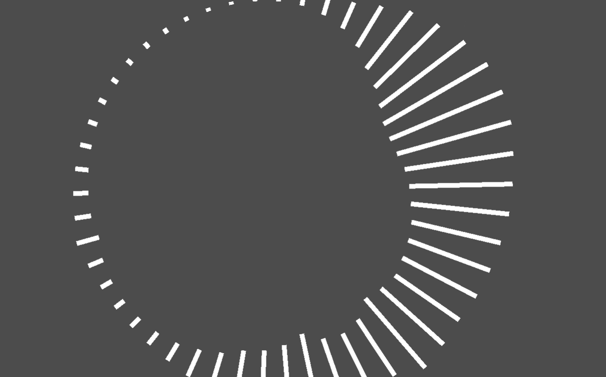
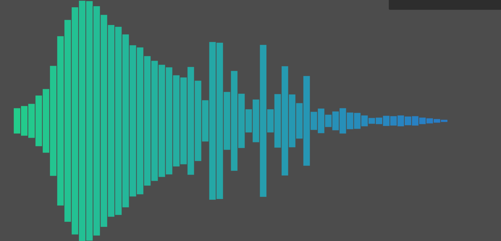
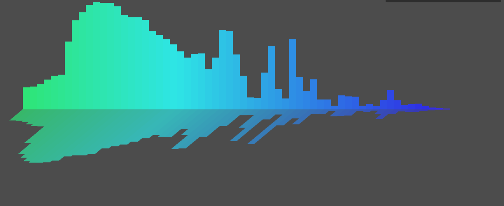
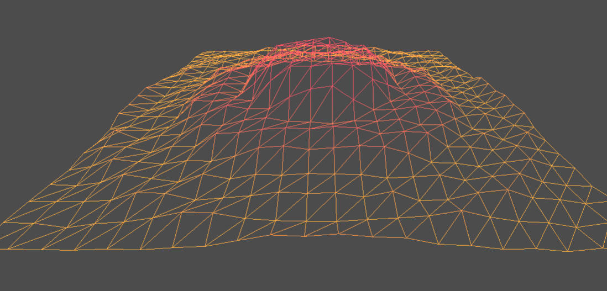
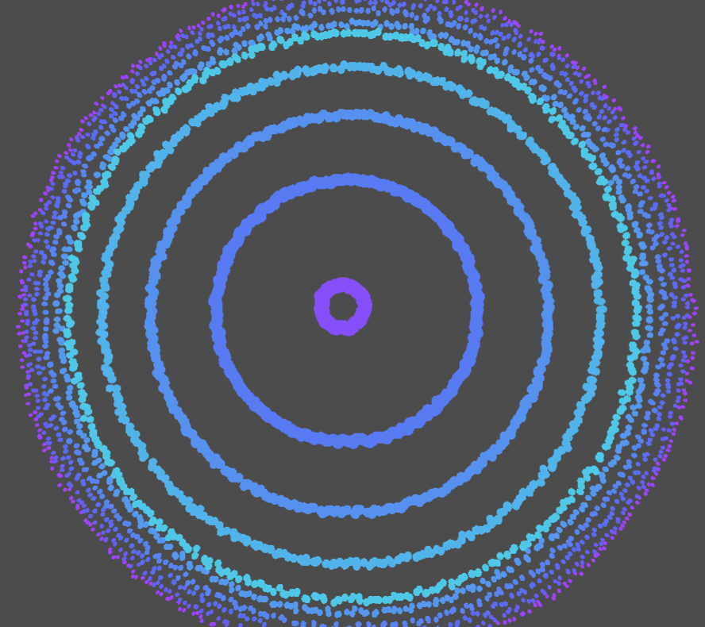
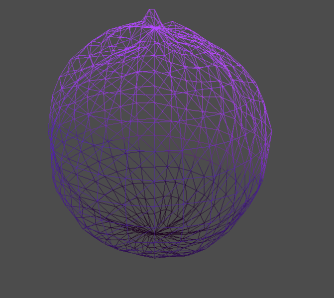
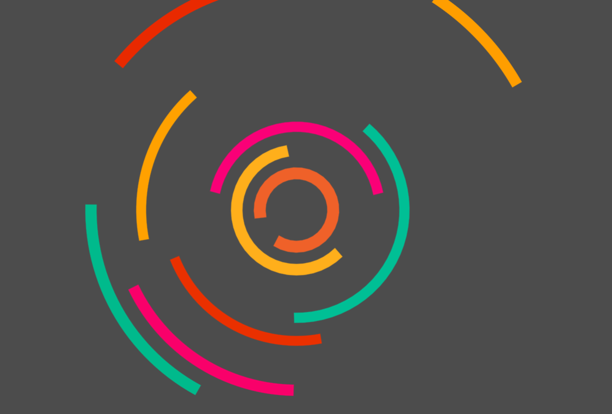
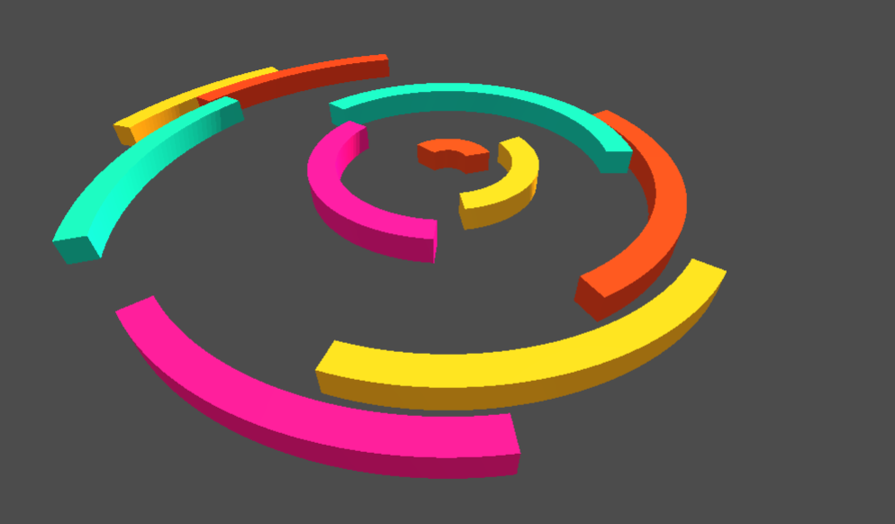
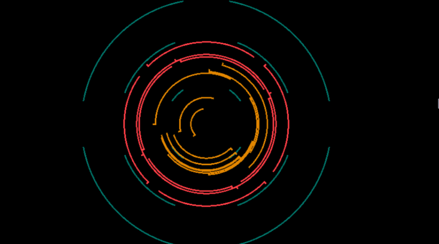

# Musical Pixels

<!-- TABLE OF CONTENTS -->

  
Table of Contents

  <ol>
	<a href="#about-the-project">About The Project</a>
	<li><a href="#built-with">Built With</a></li>
	<li><a href="#roadmap">Roadmap</a></li>
	<li><a href="#license">License</a></li>
	<li><a href="#contact">Contact</a></li>
	<li><a href="#acknowledgments">Acknowledgments</a></li>
  </ol>

<!-- ABOUT THE PROJECT -->
## About The Project

### Overall
Built for Hackclub Horizons, this was an experiment about what was possible with Godot. I'm honestly surprised at the results!

I apologize for not being able to export this to Itch like I usually do; I didn't have the time to figure out switching audio sources, especially cross platform, and whether it was microphone or uploading files or whatever. I wanted to focus on the audio visualization, not the loading of files. Sorry!

### What even is this?

Very minimal music visualizer that takes system audio (from a [gdextension I vibecoded](https://github.com/pixelsaver/miniaudio-gdextension)) and analyzes it using FFT (not my library) to then visualize it a few different ways. 
It's got:
- 10 different visualizers
- Cool colors (for most of them)
- 2d & 3d
- Amplitude based and frequency based
- Scroll to change sensitivity
- Picking the background color (transparency works too hopefully)
- Automatically hidden UI

> [!NOTE]
> This has not been tested for Mac Users; I'm not sure the extension works, and I'm not sure transparency works. 

### What do I take out of this?
Learn C... The gd extension is so useful. Also, there are so many cool people out there, that it's a shame not to do research on what people have done already!

(<a href="#readme-top">back to top</a>)

### Screenshots & Videos

Reminder: These backgrounds are going to be transparent on Windows (and possibly on Mac??)

https://github.com/user-attachments/assets/c669b7a5-f19d-426c-b282-b522e31e1bb3

#### Notes
- The UI dissappears after 4 seconds of inactivity (no mouse movement)
- The background looks drab because it's supposed to be transparent...

(<a href="#readme-top">back to top</a>)
 

### Built With

This section should list any major frameworks/libraries used to bootstrap your project.

* [Godot](https://godotengine.org)
* [Zed](https://www.zed.dev) as my IDE
<!--
* [![Next][Next.js]][Next-url]
* [![React][React.js]][React-url]
* [![Vue][Vue.js]][Vue-url]
* [![Angular][Angular.io]][Angular-url]
* [![Svelte][Svelte.dev]][Svelte-url]
* [![Laravel][Laravel.com]][Laravel-url]
* [![Bootstrap][Bootstrap.com]][Bootstrap-url]
* [![JQuery][JQuery.com]][JQuery-url]-->

(<a href="#readme-top">back to top</a>)

## Roadmap
Honestly, there is so much more to do! I'll leave a list down below for what ideas I have now, but I'm dropping this project because I don't want to be stuck on this for too long, and I have other ideas for things to do!! I think. If there's at least 10 people who star this or contact me, I'll be happy to come back and improve this by miles!
- [ ] Better UI for selection & customization
    - [ ] Gradients
    - [x] Sensitivity
    - [ ] Etc
- [ ] Transitions between visualizers
- [ ] More 3d animations
    - [ ] Rotating cylinder of 3d arcs
    - [ ] Spherical arcs spinning
    - [ ] Moving through a sea of shapes
- [ ] More responsiveness
    - [ ] Tuning to specific sections (bass, mid, treble)
    - [ ] Reacting to song sections (intro, rise, drop, etc)
- [ ] More colors
- [ ] Reading from microphone / chosen input 
- [ ] Actual borderless window you can drag and resize, so it looks super cool!
- [ ] Loading custom files
    - [ ] Displaying lyrics
    - [ ] Cool lyrics (to the tune / beat)
    - [ ] Lyrics being placed like a word cloud
- [ ] More that I haven't thought of!

<!-- LICENSE -->
## License

Distributed under the MIT License. See `LICENSE` for more information.

(<a href="#readme-top">back to top</a>)

<!-- CONTACT -->
## Contact

Pixel Saver - [itch.io](https://pixelsaver.itch.io/) 

Project Link: [https://github.com/PixelSaver/Just-U-and-I](https://github.com/PixelSaver/Just-U-and-I)

(<a href="#readme-top">back to top</a>)

<!-- ACKNOWLEDGMENTS -->
## Acknowledgments

Like any great thing, this was not done alone! Lot's of inspiration was used for ideas on how to visualize data!

* [Obsidian by xplsv](https://mrdoob.com/files/temp/xplsv_obsidian/) - Really cool color scheme, it's a shame that I didn't get to dive too deep into the MultiMesh capabilities
* [Audio Visualizer by Teoxoy](https://teoxoy.github.io/audio-visualizer/) - Minimal, but amazing!! 
* [Audio Visualizer by Amandayehh](https://amandayehh.github.io/audio-visualizer/) - This one is super simple shapes, but somehow catches the different sections of songs!!
* [Experiment 8 by Bruno Imbrizi](https://brunoimbrizi.com/experiments/#/08) - My personal favorite of the bunch! Super cool animation and transitions
* [Vizz.fm](https://vizz.fm/app/) - Nice to show the possibilities of ltos of points
* [Awesome Audio Visualization Compilation by Willian Justen](https://github.com/willianjusten/awesome-audio-visualization) - Couldn't have found the others without this list!

(<a href="#readme-top">back to top</a>)

